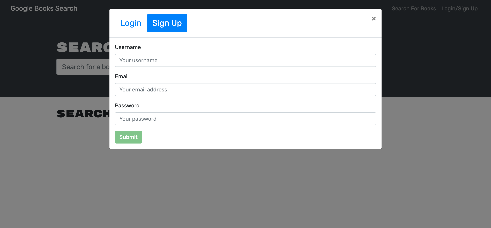

# Book Search Engine

## Description

Once new technologies have been created, employees may be required to refactor code to implement this new technology. To improve this skill, I refactored this application to use GraphQL. Creating this application was good practice in both refactoring and using GraphQL.

## Table of Contents

- [Installation](#installation)
- [Usage](#usage)
- [Credits](#credits)
- [License](#license)
- [Badges](#badges)

## Installation

1. Click on green code button and copy the ssh link
2. Open up terminal or git bash, then navigate to where you want the repository to be placed.
3. Type out "git clone (ssh link)"
4. Be sure to install Node.js. Node.js is necessary to run this program. If you need to, download it from the [Node.js website](https://nodejs.org/en/download/).
5. Once you have installed Node.js, navigate to inside the 'book-search-engine' folder
6. Run 'npm run install' to install packages within package.json
7. Run 'npm run build' to build the react application on your computer

## Usage

To run this website, navigate into your 'book-search-engine' folder and run 'npm run develop' in your terminal. You can also navigate to [my website](https://git.heroku.com/book-search-refactored.git).

Once there, you will be greeted by search screen. 

Although you can stil search books, you should login/signup for entire functionality. To do this, click on the login/signup button in the navbar. This will take you cause the login/signup modal to pop up.

You can toggle between login and signup using the buttons on the top of the modal.

Once you submit you user information, you will be taken back to the search screen. Here, you can use the search bar to search for key words to find books.

Once the desired word(s) have been put into the search bar, press 'return' or the 'Submit Search' button. This will populate your screen with books that match your search criteria.

If you scroll down, you can see that the books cards have 'Save this Book!' buttons. These allow you to save the book for later reference in your profile.

To see your saved books, click on the 'See Your Books' in the navbar. This will take you to a page where you can view your saved books. From this page, you can delete them from your saved list. 

## Credits

input types in graphQL: https://graphql.org/graphql-js/mutations-and-input-types/ 

installing mongodb: https://coding-boot-camp.github.io/full-stack/mongodb/deploy-with-heroku-and-mongodb-atlas 

## License

Please refer to LICENSE in this repository

## Badges

